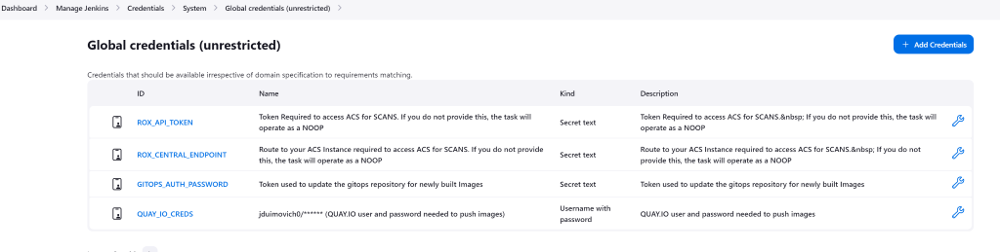

# TSSC Multi-CI Development for RHTAP

This repository contains the innerloop development environment for the Multi-CI translations from the RHTAP Pipelines. This repository can also be directly tested in the CI system as it includes a copy of a sample source app for RHTAP (node.js) as well as a gitops repo for that deployment. This may be moved to a separate repo in future dev mode builds.


 This repo includes Jenkins, Gitlab and Github Actions tests of the scripts

The tasks appear in the `rhtap` directory and are updated manually. Once updated they can be tested locally in the shell or pushed to the appropriate CI system and tested in that CI.

This includes:
  1. A Jenkins shared library to be tested in Jenkins as well as Developer Hub as part of RHTAP. 
  2. A gitlab CI file which can be pushed to gitlab in a fork of this repo to test it
  3. A github actions workflow which can be run manually in this repo or pushed to a test repo to validate. When github actions are created for some of the tasks, this will require publishing to github individual to test. 

## Development Mode 

In development mode, the pipeline scripts can be tested using local shell scripts.

`bash build-pipeline.sh` to run a build which will create the Image, SBOM and other artifacts from your local shell. 
`bash promote-pipeline` to run a promotion script which will run the promotion flow, upload SBOM (some systems) and validate  Enterprise Contract.

The local execution requires binaries to be installed in your cluster on your path. The shell scripts will print error message if any binaries are missing. 

## Releasing to Templates and Jenkins Library 

### Jenkins 

In order to run in RHTAP via software templates, you need to release to a fork of templates https://github.com/redhat-appstudio/tssc-sample-templates and install these into RHTAP. When validated in a fork, send a pull request to the release templates repo. 

In order to run the Jenkinsfile you must push to the Jenkins library https://github.com/redhat-appstudio/tssc-sample-jenkins
If you want to use a fork you must update your jenkinsfile to reference your fork repository in the jenkins file. 

```
library identifier: 'RHTAP_Jenkins@main', retriever: modernSCM(
  [$class: 'GitSCMSource',
   remote: 'https://github.com/redhat-appstudio/tssc-sample-jenkins.git'])
```

To update forks, in preparation for sending pull requests to the official library locations, you can run ` bash hack/copy-to-tssc-templates` to update your local forked repos and then manually check and push to your branch. 


### TODO - update to include gitlab and gihub 


## Creating a cosign signing secret

Take a look in `hack/create-sign-secret`. If you run the build pipeline in development mode this script would have already been used to create the git ignored file `rhtap/signing-secret-env.sh`, but you can run it again manually to generate a fresh signing secret.

When running in Jenkins, each of the three values generated by that script need to be created as "Secret text" credentials in Jenkins. Use the environment variable name as the credential ID and the long encoded string as the secret.

## Quick-start for testing the build pipeline and the promote pipeline in development mode

Assuming that `QUAY_IO_CREDS_USR`, `QUAY_IO_CREDS_PSW` and `MY_QUAY_USER` environment variables are set and exported already.

```
export REKOR_HOST='' TUF_MIRROR=''
(bash build-pipeline.sh && export MY_IMAGES_TO_VERIFY=$(hack/show-image-ref) && bash promote-pipeline.sh) | tee log.out
```

Note that the MY_IMAGES_TO_VERIFY is a workaround so that the image being verified is the image that was just built. This is only for development purposes. If MY_IMAGES_TO_VERIFY is not set then the image list will be produced by the `gather-deploy-images` script as per usual.


## Jenkins mode

This repository is a Jenkins buildable repository. You manually create a `pipeline` project in Jenkins, and reference the Jenkinsfile in Jenkins.  You can then run a build.

To test in Jenkins, `MY_QUAY_USER`, `REKOR_HOST`, `TUF_MIRROR` and `MY_IMAGES_TO_VERIFY` should be set as environment variables in Jenkins.

## Configuring Jenkins

Binaries
The agent machines running jenkins (or if on master, that machine will need to have binaries configured for the jenkins user running the pipelines)

These will be checked prior to allowing execution to proceed. If any binaries are missing, there will be an error message printed. Install the required binary and re-run the shell mode or the jenkins agent. 

```
ENV vars:
OK: IMAGE_URL
OK: IMAGE
OK: QUAY_IO_CREDS_USR
OK: QUAY_IO_CREDS_PSW
OK: DISABLE_ACS
OK: GITOPS_AUTH_PASSWORD
OK: POLICY_CONFIGURATION
OK: REKOR_HOST
OK: IGNORE_REKOR
OK: INFO
OK: STRICT
OK: EFFECTIVE_TIME
OK: HOMEDIR
Binaries:
OK: git in /usr/bin/git
OK: curl in /usr/bin/curl
OK: jq in /usr/bin/jq
OK: yq in /usr/local/bin/yq
OK: buildah in /usr/bin/buildah
OK: syft in /mnt/g/wslbin/syft
OK: cosign in /usr/local/bin/cosign
OK: python3 in /usr/bin/python3
Env vars and binaries ok
```

The library requires some secrets to be defined in your Jenkins cluster

There are utility scripts in the hack directory which allow automated setting of the Jenkins Secrets. You will need local env vars, and your Jenkins access token configured. Run the script and it will tell you what you are missing.
It will set the credentials required for the Jenkins pipeline to work.

To set the secrets, run `hack/jenkins-set-secrets`
To validate secrets are set  run `hack/jenkins-get-secrets`

You can also check the credentials view in your Jenkins instance. 




### Gitlab CI
TO DO
## Configuring Gitlab CI

### Github Action
TO DO 
## Configuring Actions


